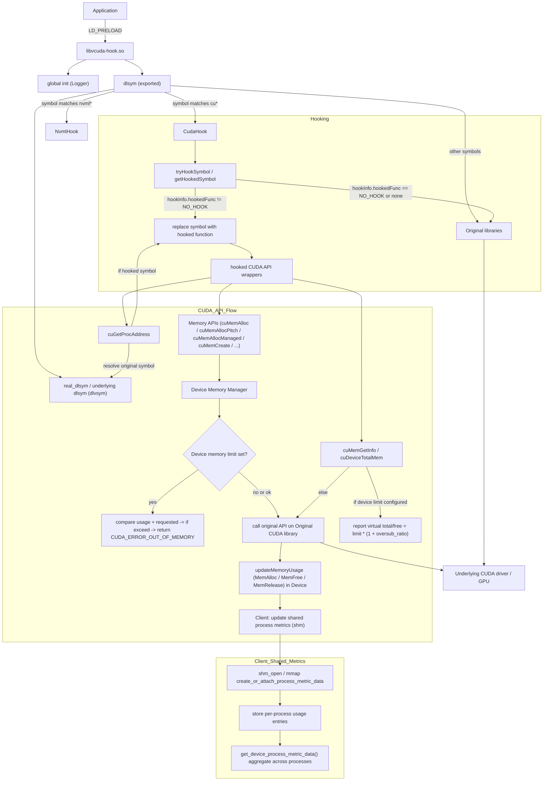

# vcuda-hook
[](https://app.fossa.com/projects/git%2Bgithub.com%2FScaletKlazz%2Fvcuda-hook?ref=badge_shield)


a transparent-level library overhook lib-cuda and lib-nvidia-ml

# Build Dependencies
- [CMake](https://cmake.org) >= 3.19
- [Docker](https://www.docker.com) > 20.10
- [CUDA](https://developer.nvidia.com/cuda-zone) >= 12.6
- [Yaml-cpp](https://github.com/jbeder/yaml-cpp) > 0.7
- [Spdlog](https://github.com/gabime/spdlog) > 1.x

# How to Use
## build
1. build builder image
```
bash ./hack/build-builder.sh
```
2. build library
```
bash ./hack/build-via-docker.sh
```
## configure
```
# use env
export LD_PRELOAD=/path/to/libvcuda-hook.so
export VCUDA_LOG_LEVEL=debug
export VCUDA_MEMORY_LIMIT=(1024 * 1024 * 1024 * 10) // limit 10G
```
## usage
```
# manual
your_application

# or use docker
docker run -it --gpus all --rm -v /path/to/libvcuda-hook.so:/usr/lib64/libvcuda-hook.so -e LD_PRELOAD=/usr/lib64/libvcuda-hook.so vllm/vllm-openai:latest bash
```

# Features

## GPU Virtualization Features

### Base Features
- ✅ Minimal Performance Overhead
- ✅ Fractional GPU Usage
- ✅ Fine-grained GPU Memory Control
- ✅ Multi‑Process GPU Memory Unified Control
- ✅ Container GPU Sharing
- ☐ Kubernetes Support
- ...

### More Features
- ☐ Oversub GPU Memory Control
- ☐ GPU Task Hot Snapshot
- ...

### Flow Diagram



## Why This Project?
Based on several core motivations, I developed this project:

- Personal Technical Interest and Professional Needs: Driven by interest in GPU virtualization technology and CUDA programming, along with related requirements encountered in practical work
- Open Architecture: Provide an open-source solution that allows the community to participate in improvements and feature extensions
- High Scalability: Design a flexible architecture that supports various GPU virtualization scenarios, including GPU resource sharing in containerized environments
- Dynamic Controllability: Implement runtime dynamic configuration and management capabilities, allowing GPU resource allocation adjustments based on demand
- Transparent Proxy Layer: Serve as a transparent proxy for CUDA dynamic libraries, enabling GPU virtualization functionality without modifying existing applications

This project aims to provide a simple and easy-to-use GPU virtualization solution for containerized environments, enabling safe and efficient sharing of GPU resources among multiple containers.

## Contributing
[Code of conduct](/CODE_OF_CONDUCT.md)

## License
[](https://app.fossa.com/projects/git%2Bgithub.com%2FScaletKlazz%2Fvcuda-hook?ref=badge_large)